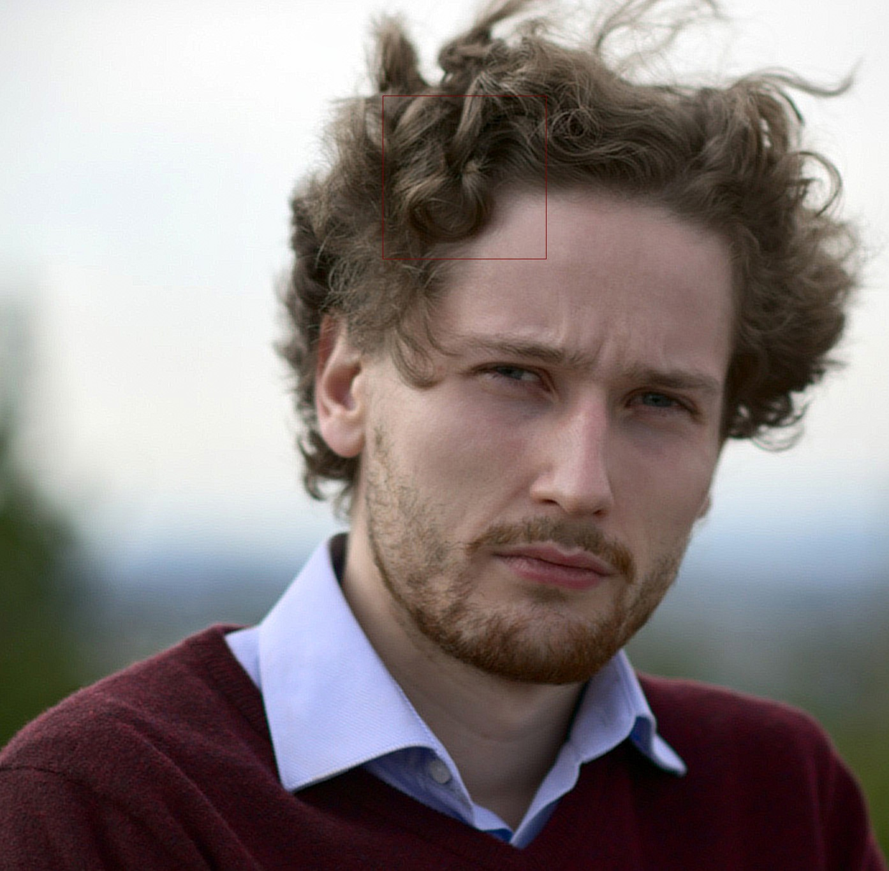

# Image Cases Studies
Python prototypes for image processing methods

© 2017 - Aurélien Pierre, Polytechnique Montréal.

## Presentation

### Motivation

This collection of scripts is intended to prototype methods and functionalities that
could be useful in [darktable](https://github.com/darktable-org/darktable) and
show proofs of concept.

### Intent

While most studies in digital imagery and signal processing focus on making things possible,
investigating options, analysing SNR and computing errors and convergence, they tend to produce unnatural results
with artifacts, looking unpleasant to the eye. 

This work tries to implement state-of-the-art algorithms into a realistic framework for photography and photographers, 
realistic both in terms of computation time and of photographic results. 

### How it's made

It's written in Python 3, and relies on PIL (Python Image Library) for the I/O, Numpy for the arrays
operations, and Numba to optimize the execution time. Heavy arrays operations 
are parallelized through multiprocesses but can be run serialized as well.


Every function is timed natively, so you can benchmark performance. 

### What's inside

For now, we have :

* Filters :
    * Gaussian blur
    * Bessel blur (Kaiser denoising)
    * Bilateral filter
    * Unsharp mask
    * Richardson-Lucy blind and non-blind deconvolution with Total Variation regularization
        * method TV-PAM : http://www.cvg.unibe.ch/dperrone/tvdb/index.html
        * method TV-PD (work in progress) : http://www.cvg.unibe.ch/dperrone/logtv/index.html
        * method TV-MM (work en progress) : ibid.
* Windows/Kernels : (*for convolution and frequential analysis*)
    * Poisson/exponential
    * Kaiser-Bessel
    * Gauss
    * Uniform
    
A collection of test pictures is in `img` directory and the converted pictures
are in `img` subfolders. The built-in functions are in the `lib.utils` module.

### What may come one day

* Refocusing : 
    * http://web.media.mit.edu/~bandy/refocus/PG07refocus.pdf
    * http://manao.inria.fr/perso/~ihrke/Publications/wscg12.pdf
    * https://users.soe.ucsc.edu/~milanfar/publications/journal/dbe_tip_final.pdf
* TV denoise : http://scikit-image.org/docs/dev/auto_examples/filters/plot_denoise.html
* Markov-chain Monte-Carlo denoise : http://www.sciencedirect.com/science/article/pii/S016516841100096X
* Lens PSF calibration : 
    * http://www.cim.mcgill.ca/~langer/MY_PAPERS/MannanLanger-CRV16-DFDCalib.pdf
    * http://people.csail.mit.edu/yichangshih/lensEnhancement/lensFittingEccv_camera_ready.pdf
    * http://people.csail.mit.edu/sparis/publi/2011/iccp_blur/Kee_11_Optical_Blur.pdf
    * http://wwwuser.gwdg.de/~uboehm/images/25.pdf
    * http://www.cs.ubc.ca/labs/imager/tr/2013/SimpleLensImaging/SimpleLensImaging_Heide2013.pdf
    
### Current prototypes


#### Richardson-Lucy deconvolution

In theory, blurred and noisy pictures can be perfectly sharpened if we perfectly 
know the [*Point spread function*](https://en.wikipedia.org/wiki/Point_spread_function) 
of their maker. In practice, we can only estimate it.
One of the means to do so is the [Richardson-Lucy deconvolution](https://en.wikipedia.org/wiki/Richardson%E2%80%93Lucy_deconvolution).

The Richardson-Lucy algorithm used here is  modified to implement [Total Variation regularization
](http://www.cs.sfu.ca/~pingtan/Papers/pami10_deblur.pdf). It can be run in a non-blind fashion (when the PSF is known)
or in a blind one to determine the PSF iteratively from an initial guess.

##### Blurred original :


##### After (fast algorithm - 35 s - 50 iterations - Non blind):
This takes in input an user-defined PSF guessed by trial and error.


##### After (myope algorithm - 73 s - 50 iterations - Semi-Blind refinement):
This takes in input an user-defined PSF guessed by trial and error but will refine it every iteration on a 256×256 px sampling patch.
(drawn in red here).


##### After (blind algorithm, PAM method - 106 s - 99 iterations - Blind):
This takes no input and will build the SPF along from scratch. 
A balance between the masked zone weight and the whole image weight in the computation can be adjusted.



##### After (blind algorithm, MM method - 10 min - 450 iterations - Blind):
This is the implementation of the Majorization-Minimisation algorithm proposed by Perrone & Favaro in 2015.
The computations are much slower although they can be parallelized but you see less artifacts and a better contrast.


## Installation

It's not recommended to install this *unstable* framework on your Python environnement, but rather to build
its modules and use it from its directory.

    python setup.py build_ext --inplace

On Linux systems, if you have Python 2 and 3 interpreters installed together, you may run :

    python3 setup.py build_ext --inplace
    
The Python interpreter should be in the 3.x serie (3.5 is best).
    
Unfortunately, the setup file has been reported defective so in most cases, the dependencies will
not be automatically installed.

To solve this problem until an elegant solution is found, the simpliest way is to first install the [Anaconda Python distribution](https://www.anaconda.com/download/)
which is a bundle of Python packages for scientific computation and signal processing.

Then, ensure the following packages are installed :

    PIL (known as pillow)
    numba
    scipy 
    numpy (normally included into scipy)
    sympy
    skimage
    pyfftw

    
## Use

### In console

Execute :

```shell
 python3 richardson_lucy_deconvolution.py 
```

Import the required Python packages : 

```python
from lib import utils # if you are working directly in the package directory
from PIL import Image 
import numpy as np
from skimage import color
```
    
Load an image as a 3D RGB array:

```python
with Image.open("path/image") as pic:

        pic = np.array(pic).astype(float)
```
    
Set/Reset RGB channels 

```python
pic[..., 0] = numpy.array([...]) # sets the R channel with a 2D numpy array
pic[..., 1] = numpy.array([...]) # sets the G channel with a 2D numpy array
pic[..., 2] = numpy.array([...]) # sets the B channel with a 2D numpy array
```
    
    
Blur a channel : 

    i = # 0, 1 or 2
    pic[..., i] = utils.bilateral_filter(pic[..., i], 10, 6.0, 3.0)
    
Save the picture :
    
```python
with Image.fromarray(pic) as output:

    output.save("file.jpg")
```
    
See the scripts in the root directory for real examples.
