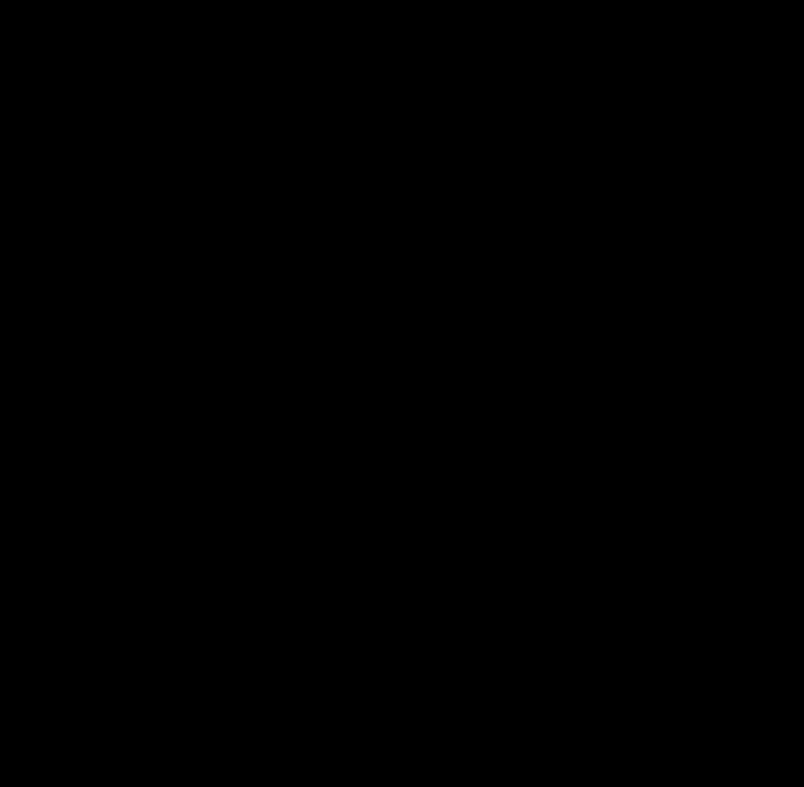

 # Image Cases Studies
Python prototypes of image processing methods

## Presentation

### Motivation

This collection of scripts is intended to prototype methods and functionalities that
could be useful in [darktable](https://github.com/darktable-org/darktable) and
show proofs of concept.

### How it's made

It's written in Python 3, and relies on PIL (Python Image Library) for the I/O, Numpy for the arrays
operations, and Cython to optimize the execution time. Heavy arrays operations 
are parallelized through multithreading but can be run serialized as well.


Every function is timed natively, so you can benchmark performance. 
The built-in functions are staticly typed and compiled with Cython.

### What's inside

For now, we have :

* Blending modes :
    * overlay
* Filters :
    * Gaussian blur
    * Bessel blur (Kaiser denoising)
    * bilateral filter
    * unsharp mask
    * Richardson-Lucy deconvolution with damping factor (similar to Matlab)
* Windows/Kernels : (*for convolution and frequential analysis*)
    * Poisson/exponential
    * Kaiser-Bessel
    * Gauss
    
A collection of test pictures is in `img` directory and the converted pictures
are in `img` subfolders. The built-in functions are in the `lib.utils` module.
    
### Current prototypes

#### Unsharp mask with bilateral filter

[Unsharp masking](https://en.wikipedia.org/wiki/Unsharp_masking)
is usually performed with a Gaussian blur and results in halos
around the sharp edges of the image.

Using a [bilateral filter](https://en.wikipedia.org/wiki/Bilateral_filter) 
(e.g a *surface blur*) on the L channel allows to perform a better unsharp mask without
halos, because we don't sharpen the edges. It's much slower though.
Run or see `bilateral_unsharp_mask.py`.

Before :


After :


This 1.7 Mpx picture took around 18s to compute on an Intel i7 2.20 GHz Sandy Bridge with 8 threads. 

#### Defringe with bilateral filter

Purples and green fringes along edges are classic chromatic aberrations caused by lenses that
occur at wide aperture. Defringing is usually performed with edge detection, by desaturing
edges. However, this can lead to legitimate purple edges (lips, signs) becoming muddy grey. 

Using a [bilateral filter](https://en.wikipedia.org/wiki/Bilateral_filter) 
(e.g a *surface blur*) on the A channel allows fringe reduction without affecting
the legitimate edges. 


Before :


After :


This 1.7 Mpx picture took around 13s to compute on an Intel i7 2.20 GHz Sandy Bridge with 8 threads. 

#### Richardson-Lucy deconvolution

In theory, blurred and noisy pictures can be perfectly sharpened if we perfectly 
know the [*Point spread function*](https://en.wikipedia.org/wiki/Point_spread_function) 
of their maker. In practice, we can only estimate it.
One of the means to do so is the [Richardson-Lucy deconvolution](https://en.wikipedia.org/wiki/Richardson%E2%80%93Lucy_deconvolution).

The Richardson-Lucy algorithm used here is slightly modified :

 1. it has a damping coefficient wich allows to remove from 
    the iterations the pixels which deviate to much from the original image.
    These pixels are considered 
    noise and would be amplificated from iteration to iteration otherwise.
    
 1. it has a masking feature that allows to select the zone where the deconvolution
    has to be performed, namely where the focus is supposed to be. Computing the deconvolution
    on the whole image when background blur (*bokeh*) is present will lead to instable
    and noisy results. So the deconvolution parameters can be estimated on a single
    zone and then applied on the whole image.

Original :


Blured :


After (No masking):


After (Masking on the red rectangle - fast algorithm - 117 s - 200 iterations):


After (Masking on the red rectangle - best algorithm - 122 s - 60 iterations):

The "best" algorithm oversamples the picture by 2 before applying the deconvolution
and then resizes it back, using Lanczos interpolation. This leads to an almost invisible
noise but increases dramatically the running time, for a small visual improvement.

After (Masking on the red rectangle - extrapolated algorithm - 292 s (not optimized) - 260 iterations):

The extrapolated algorithm combines uses of the fast and best algorithm with the 
[Richardson extrapolation](https://en.wikipedia.org/wiki/Richardson_extrapolation).
The final image is 2 × (best image) - (fast image) and is supposed to converge twice
as fast as the best or fast algorithms towards the perfect deblured image. 
As we combine 2 different noise patterns, the final image has a more natural noise,
less smudgy than the fast but sharper than the best.

FIXME! These algorithm need a stopping condition based on their convergence.

## Installation

It's not recommended to install this *unstable* framework on your Python environnement, but rather to build
its modules and use it from its directory.

You need `distutils` and `cython` prior to anything. Then, the following command will
build the C modules and check the dependencies :

    python setup.py build_ext --inplace

On Linux systems, if you have Python 2 and 3 interpreters installed together, you may run :

    python3 setup.py build_ext --inplace

    
## Use

Import the required Python packages : 

```python
from lib import utils # if you are working directly in the package directory
from PIL import Image 
import numpy as np
from skimage import color
```
    
Load an image as a 3D RGB array:

```python
with Image.open("path/image") as pic:

        pic = np.array(pic).astype(float)
```
    
Set/Reset RGB channels 

```python
pic[..., 0] = numpy.array([...]) # sets the R channel with a 2D numpy array
pic[..., 1] = numpy.array([...]) # sets the G channel with a 2D numpy array
pic[..., 2] = numpy.array([...]) # sets the B channel with a 2D numpy array
```
    

Convert to LAB channels 

    pic = color.rgb2lab(pic / 255)
    
Convert back to RGB before saving

    pic = (color.lab2rgb(pic) * 255).astype(np.uint8)
    

Blur a channel : 

    i = # 0, 1 or 2
    pic[..., i] = utils.bilateral_filter(pic[..., i], 10, 6.0, 3.0)
    
Save the picture :
    
```python
with Image.fromarray(pic) as output:

    output.save("file.jpg")
```
    
See the scripts in the root directory for real examples.
